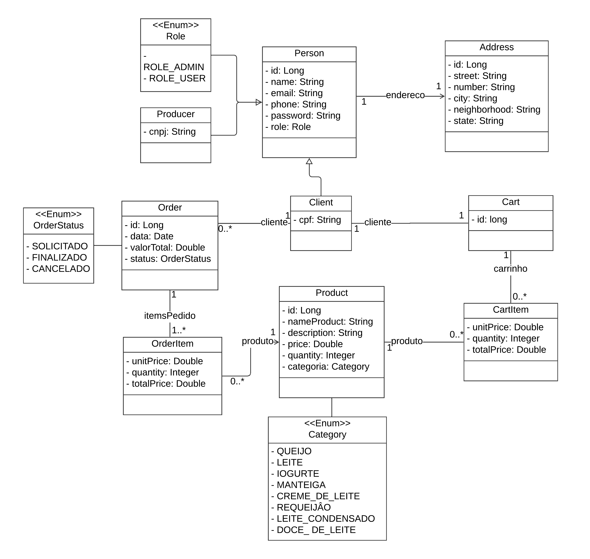

# ecommerce-laticionios
Este projeto é uma plataforma de e-commerce para a venda de laticínios por encomenda, desenvolvida para um vendedor autônomo. A plataforma é composta por três partes principais:
- Backend: A API responsável por gerenciar produtos, pedidos, autenticação e fornecer dados para os frontends.
- Frontend do Administrador: Interface para o produtor gerenciar produtos, pedidos e visualizar relatórios de vendas.
- Frontend do Cliente: Interface para os clientes navegarem no catálogo de produtos, fazerem pedidos e gerenciarem suas contas.

## Visão Geral do Projeto
O **ecommerce-laticionios** é uma plataforma de e-commerce projetada para facilitar a venda de laticínios sob encomenda. Ele permite que um vendedor autônomo gerencie seu catálogo de produtos, pedidos e vendas de maneira eficiente. 

Os clientes podem navegar pelos produtos e fazer pedidos de forma prática, enquanto o administrador tem acesso a um painel de controle completo para monitoramento e gerenciamento do negócio.

## Diagrama de Classes



# Como Navegar no Repositório

O repositório está dividido em duas pastas principais, cada uma com seu próprio README detalhado. Clique nos links abaixo para saber mais sobre cada parte do projeto:

* [Backend](/ecommerce-backend): API desenvolvida em Java com Spring Boot, responsável pelo gerenciamento de produtos, pedidos e autenticação.
* [Frontend do Administrador](/ecommerce-frontend/admin-app):  Interface para o vendedor gerenciar produtos, pedidos e relatórios.
* [Frontend do Cliente](/ecommerce-frontend/cliente-app):  Interface para os clientes fazerem pedidos.

## Tecnologias Utilizadas
- **Frontend**: Angular, Tailwind CSS, Flowbite
- **Backend**: Java, Spring Boot
- **Banco de Dados**: H2 para testes
- **Autenticação**: JWT
- **Versionamento**: Git

### Passos para Execução
1. Clone o repositório:
   ```bash
   git clone git@github.com:JhonnyBCastro/ecommerce-laticionios.git
   ```

## 💻 Requisitos e Instalação

Antes de começar, faça os seguintes passos:

### 1. Instalação do Node.js e Angular
- Instale o node em sua maquina [Download Node.js](https://nodejs.org/en/download)

```bash
node -v  # Verificação da versão do Node.js
npm -v   # Verificação da versão do npm
```

### 2. Instale o Angular CLI:

```bash
npm install -g @angular/cli
```

### 3. Instale dependências adicionais para o frontend:

```bash
npm install tailwindcss @tailwindcss/postcss postcss --force #(Terminal do Projeto)
npm install flowbite #(Terminal do Projeto)
ng generate @angular/core:control-flow #(Terminal do Projeto)

npm install ngx-cookie-service --save 
npm install jwt-decode
```

---

### Executando o Frontend
No diretório do frontend, execute:

```bash
ng serve
```

---

### 4. Executando o Backend
Requisitos:
* Java JDK 11 ou superior
* Maven

Acesse a pasta do backend:
```bash
cd ecommerce-backend
```
Compile e execute o projeto:

```bash
mvn spring-boot:run
```

---

## 🤝 Colaboradores

Agradecemos às seguintes pessoas que contribuíram para este projeto:

<table>
  <tr>
    <td align="center">
      <a href="https://github.com/suelenmedinape" title="defina o título do link">
        <br>
        <sub>
          <b>Suelen Medina</b>
        </sub>
      </a>
    </td>
  </tr>
</table>

---

Este documento será atualizado conforme novas funcionalidades forem implementadas.

---
